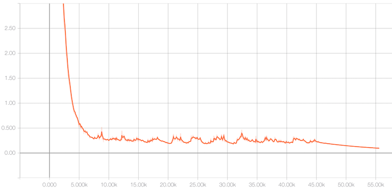

# Face Detection Project

- Author: LIN JIANING

- Date: 2017.11

- Course: Machine Learning

- Hardware: GPU servers on Alibaba Cloud

- Language: Python

- Platform: TensorFlow

- Description: In this project, We trained a model to recognize different human faces. There are 1311 persons in this database given by our professor and each person has 48 different photos of their face. To train this model, we divide the given data into two parts-2/3 of them are for training, and the other are for evaluation. We implemented CNN and used `maxout` and mimic the structure of `Lightened CNN` for this project, and the Code is based on the offical code given by Tensorflow for training in cifar-10 database.

| Parameter      | Value                      |
| -------------- | -------------------------- |
| Batch_size     | 128                        |
| Learning_rate  | 0.1(decay_factor=0.1)      |
| Step           | 40000                      |
| Optimizer      | SGD/Momentum               |
| Dropout        | Yes                        |
| Regularization | no                         |
| Key point      | ` Maxout`/`Lightened CNN ` |

- Result:
  - Accuracy: 95% in the given evaluation dataset, 88% in the  testing dataset tested by TA

  - Rank: top 10% in the class(200 students)

  - Loss

